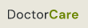
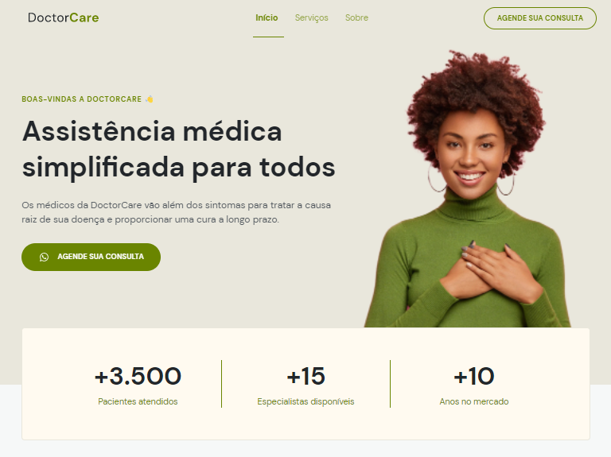

<h1 align="center">
    
</h1>

<p align="center">
  <a href="#-technologies">Technologies</a>&nbsp;&nbsp;&nbsp;|&nbsp;&nbsp;&nbsp;
  <a href="#-layout">Getting started</a>&nbsp;&nbsp;&nbsp;|&nbsp;&nbsp;&nbsp;
  <a href="#-project">Project</a>&nbsp;&nbsp;&nbsp;|&nbsp;&nbsp;&nbsp;
  <a href="#-layout">Layout</a>&nbsp;&nbsp;&nbsp;|&nbsp;&nbsp;&nbsp;
  <a href="#-license">License</a>
</p>

<p align="center">
  
  
  

  
</p>

<br>

<p align="center">
  
</p>

## 🧪 Technologies

This project was developed using the following technologies:

- [Javascript](https://#)
- [HTML](https://#)
- [CSS](https://#)

## 🚀 Getting started

Clone the project and access the folder.

```bash
$ gh repo clone DaianeL/ProjetoNLW && cd project
```

Follow the steps below

1.  Go to the index.html and open with live server.

## 💻 Project

[DoctorCare](https://doctorcare-daianelima.netlify.app/) 💜

This is a project developed during the **[Next Level Week](https://nextlevelweek.com/)**, presented by **[@Rocketseat](https://github.com/Rocketseat)** during Maio, 2022.

## 🔖 Layout

You can view the project layout through the links below:

- [Layout Web](<https://www.figma.com/file/Mzhm1S9egMWHalcDBk6wdP/DoctorCare-(Community)?node-id=0%3A1>)

Remembering that you need to have a [Figma](http://figma.com/) account to access it.

## 📝 License

This project is licensed under the MIT License. See the [LICENSE](LICENSE.md) file for details.

---

<p align="center">Made with ❤️ by Daiane Lima</p>
